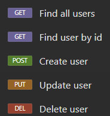
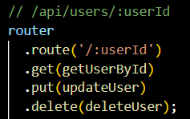
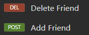
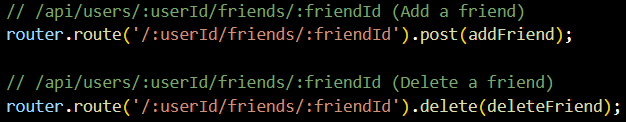
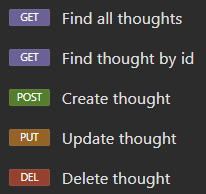
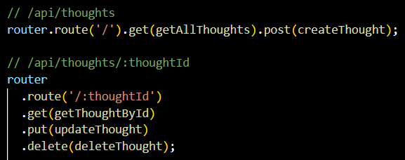
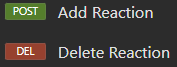
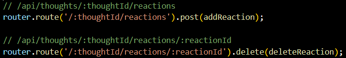

# module-17-stephen-lee

## Description

I wanted to create social media API that would enable users to share their thoughts, react to friend's thoughts, and create a friend list. I wanted this API to use Express.js for routing, a MongoDB database, and the Mongoose ODM.

## Table of Contents 

- [Installation](#installation)
- [Usage](#usage)
- [License](#license) 
- [Contributing](#contributing)
- [Tests](#tests)
- [Questions](#questions)

## Installation

Download the repository from the github link. Once downloaded, run the following on the terminal of the root folder:
* npm i
* npm run build
* npm run seed
* npm run start

## Usage
Utilize the API in insomnia

### Users

### Friends

### Thoughts

### Reactions

## Credits
- GitHub Repository: [https://github.com/leestephen0320/module-17-stephen-lee](https://github.com/leestephen0320/module-17-stephen-lee)
- Video Link: [https://drive.google.com/file/d/18S0Wf6NnmkRZ0JjktfJayiSZl1y5_kaj/view](https://drive.google.com/file/d/18S0Wf6NnmkRZ0JjktfJayiSZl1y5_kaj/view)

## License
Distributed under the MIT License.

## Tests
Follow along with the video to perform Get, Post, Put, and Delete for the different routes.